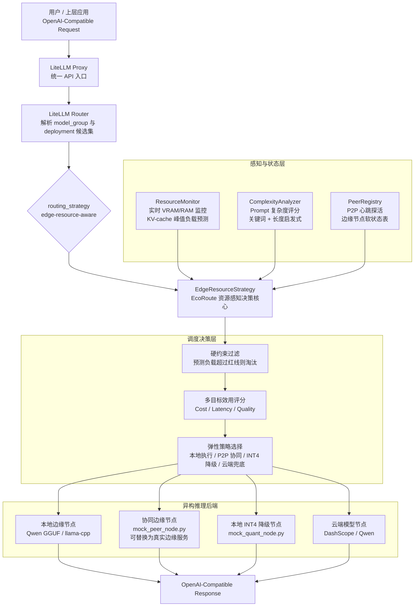

# EcoRoute-LLM：面向大模型推理的资源感知型端云协同网关

### 摘要

EcoRoute-LLM 是一个面向资源受限边缘环境的大模型推理调度系统原型。本项目不关注训练新的大模型，而是聚焦于大模型系统层面的关键问题：当本地边缘设备显存有限、任务复杂度不一、云端调用存在成本与网络依赖时，网关应如何感知资源状态、预测请求开销，并在本地推理、边缘协同、云端卸载和低精度降级之间做出动态调度决策。

本项目基于 LiteLLM 的路由层进行二次开发，在其原生 Router 中接入自定义调度策略 `edge-resource-aware`。该策略在每次请求分发前，综合考虑实时硬件负载、请求级显存增量预测、Prompt 复杂度、用户偏好权重以及边缘节点健康状态，选择更合适的推理后端。系统当前实现了三类核心能力：资源感知监控与 KV-cache 显存预算、多目标路由决策、以及面向边缘协同和量化降级的弹性推理机制。

项目的核心目标是提升小显存边缘设备上 LLM 推理服务的连续可用性和资源利用率，尽量避免“本地硬扛导致 OOM”或“所有压力直接上云”的二元策略。当前版本是一个研究型原型系统，已通过若干场景脚本验证路由逻辑和端到端控制流程，但尚未形成完整的大规模 benchmark。

## 1. 研究背景与问题定义

### 1.1 边缘部署 LLM 的资源瓶颈

将大语言模型部署在边缘侧具有现实意义。一方面，本地推理可以降低对云端 API 的依赖，减少敏感数据外传，提升弱网或离线场景下的自治能力；另一方面，边缘设备通常更接近用户或业务现场，在某些低复杂度任务中能够降低响应路径。

但边缘 LLM 推理也面临明显瓶颈。相比云端 GPU 集群，边缘设备通常只有有限的显存和算力，例如 4GB 或 8GB 显存环境只能承载轻量级模型或量化模型。在长 Prompt、较大输出长度或并发请求下，模型推理过程中的 KV-cache 会随序列长度增长而持续占用显存。也就是说，一个请求在下发前看似安全，但在 decode 阶段可能逐渐逼近甚至突破显存上限，最终触发 OOM。

这种 OOM 不只是单次请求失败，还可能造成模型服务异常、网关重试、整体响应延迟增加，甚至影响边缘节点的持续可用性。因此，对于边缘 LLM 系统，关键问题不是“能不能跑一个小模型”，而是“如何在资源不断波动的情况下稳定地调度推理请求”。

### 1.2 当前方法的不足

常见的 LLM 网关或代理系统更多关注 API 兼容、模型转发、负载均衡、失败重试和云端模型聚合。这些能力对云服务场景很有价值，但在资源受限边缘场景下仍存在不足：

- 静态路由策略无法感知本地显存压力，容易在高负载下继续向边缘节点分配任务。
- 仅基于实时负载的阈值判断不够充分，因为它没有考虑当前请求将额外产生多少 KV-cache。
- 简单的本地/云端二元策略过于粗糙，要么冒险本地执行，要么直接上云，缺少中间层次的弹性选择。
- 传统路由缺少对成本、时延和生成质量之间权衡关系的显式建模。
- 单台边缘设备容易形成算力孤岛，无法利用局域网内其他空闲边缘节点。
- 当显存处于临界区时，系统通常缺少“低精度降级”这类保持服务连续性的方案。

因此，本项目将 LLM 推理路由重新定义为一个资源感知的系统调度问题：网关需要在请求进入推理后端之前，预测其资源风险，并在异构后端之间进行约束下的多目标选择。

### 1.3 核心问题定义

EcoRoute-LLM 试图解决的问题可以概括为：

给定一个 LLM 请求和一组异构推理后端，包括本地边缘模型、P2P 协同边缘节点、低精度量化副本和云端模型，网关应如何在避免本地 OOM 的硬约束下，根据成本、时延、质量和资源状态选择合适的执行位置与执行精度。

本项目的研究重点不是单个模型本身的能力提升，而是推理系统的资源调度机制。它关注如何从“事后发现资源不足”转向“任务下发前主动预判”，从而提升边缘侧大模型系统的稳定性、弹性和资源利用效率。

## 2. 项目概述

EcoRoute-LLM 是一个基于 LiteLLM 路由层扩展的端-边-云协同推理网关原型。项目复用了 LiteLLM 的 OpenAI 兼容接口、模型配置机制和基础路由框架，在此基础上实现一个自定义资源感知调度策略。

当前系统中包含以下几类后端：

- 本地边缘推理节点：由 `local_server.py` 表示，使用 `llama-cpp-python` 加载本地 Qwen2.5-1.5B GGUF 模型，用于模拟小显存设备上的本地 LLM 推理。
- 云端模型节点：通过配置中的 DashScope/Qwen 云端接口表示，用作高质量和兜底推理后端。
- P2P 协同边缘节点：由 `mock_peer_node.py` 表示，提供 `/health/vram` 和 `/chat/completions` 接口，用于验证局域网边缘节点协同调度逻辑。
- 本地低精度降级节点：由 `mock_quant_node.py` 表示，用于验证 INT4 量化副本在高压区间接管请求的路由行为。

需要说明的是，当前 `mock_peer_node.py` 和 `mock_quant_node.py` 主要用于验证调度流程和系统设计，并不等同于完整生产级模型服务。它们可以在后续研究中替换为真实的边缘推理后端或真实量化模型服务。

从研究表达上看，EcoRoute-LLM 的核心贡献是一个系统调度原型：它将硬件资源感知、请求级显存预算、多目标效用函数、边缘节点软状态同步和低精度降级统一到 LLM 网关层。

## 3. 整体框架

系统整体采用端-边-云三层协同架构。用户请求首先进入 LiteLLM Proxy/Router。当配置中启用 `edge-resource-aware` 策略后，Router 会调用 EcoRoute 的自定义决策逻辑。该逻辑从资源监控器、复杂度分析器和边缘节点注册表中读取状态，再根据硬约束和效用评分选择一个部署节点。

这个框架可以拆分为三层：

- 感知层：收集硬件状态、请求长度、复杂度、节点健康情况等信号。
- 决策层：先进行显存安全过滤，再根据成本、时延和质量计算候选节点效用。
- 执行层：通过 LiteLLM 的 deployment 机制将请求发往选中的后端。

这种分层设计的意义在于将“资源状态采集”和“请求分发决策”解耦。边缘环境具有波动性，网关不应该等到设备失败后再重试，而应在任务进入推理前就判断其风险。

## 4. 核心技术设计

### 4.1 资源感知监控与预测（Resource-aware Monitoring and Prediction）

该模块解决的问题是：仅观察当前显存占用并不能判断一个 LLM 请求是否能安全执行。因为 LLM 解码过程中 KV-cache 会随着输入和输出 token 数增长，当前负载低并不代表执行过程不会超过显存上限。

项目中的实现位于 `litellm/resource_monitor.py`。该模块优先尝试通过 NVIDIA NVML 的 Python 接口 `pynvml` 获取真实 GPU 显存占用。如果运行环境没有可用 GPU 或 NVML 初始化失败，则退回到 `psutil` 的系统内存监控，从而保证系统在无 GPU 环境下仍可运行。

该模块的关键设计是请求级峰值负载预估。它根据输入文本长度和预期输出长度估计 token 数，再结合模型结构先验，粗略计算 KV-cache 可能带来的显存增量，并加入安全缓冲区。最终，系统得到的不是单纯的“当前显存占用”，而是“如果接受该请求，显存峰值可能达到多少”。

这一设计背后的技术思考是：边缘推理调度应从 reactive monitoring 转向 proactive admission control。也就是说，网关不应只问“现在是否拥堵”，还应问“这个请求进来之后是否会导致拥堵或 OOM”。

当前实现仍是启发式和模型相关的，没有声称适配所有模型结构。后续可以进一步引入更精确的 KV-cache 建模、prefill/decode 分阶段估计、批处理影响建模，以及基于真实运行数据的在线校准。

### 4.2 多目标路由策略（Multi-objective Routing Strategy）

该模块解决的问题是：LLM 推理路由不应只由单一指标决定。不同请求或用户可能有不同偏好，例如有的请求更重视成本，有的更重视响应质量，有的更重视时延。因此，路由策略需要显式建模成本、时延和质量之间的权衡。

项目中的实现位于 `litellm/router_strategy/edge_resource_strategy.py`。该策略首先执行硬约束过滤：如果某个节点的预测负载超过危险阈值，则直接淘汰，避免本地 OOM。随后，策略对剩余候选节点计算综合效用分数。效用函数由成本、时延和质量三类分数组成，并通过请求 metadata 中的偏好权重进行加权。

例如，在省钱优先模式下，本地边缘节点的成本优势会被放大；在质量优先模式下，云端模型或高精度模型可能获得更高评分。这样，同一个 Prompt 在不同 SLA 偏好下可以产生不同路由结果。

系统还引入了 `litellm/complexity_analyzer.py` 作为轻量级 Prompt 复杂度分析器。它通过关键词和长度进行启发式评分，例如代码、算法、数学、调试等任务会提高复杂度分数。这里没有使用额外的大模型进行语义分类，原因是网关本身必须保持低开销；如果为了调度再运行一个复杂模型，可能会让调度层成为新的性能瓶颈。

需要准确说明的是：当前系统使用的是 Pareto-inspired 的加权效用函数，并没有实现严格意义上的完整 Pareto frontier 搜索。它的价值在于将多目标权衡显式化，并让用户偏好能够影响路由决策。

### 4.3 弹性推理与边缘协同（Elastic Inference and Edge Collaboration）

该模块解决的问题是：单台边缘设备很容易成为资源瓶颈。当本地节点压力较高时，系统不应只有“上云”或“失败”两种选择，而应具备更细粒度的弹性响应能力。

项目实现了两类弹性机制。

第一类是 P2P 边缘协同。相关实现位于 `litellm/peer_registry.py`。系统维护一个边缘节点软状态表，后台守护线程周期性访问 Peer 节点的 `/health/vram` 接口，获取其健康状态和显存负载。路由决策时，`EdgeResourceStrategy` 不需要临时发起网络探测，而是直接从内存状态表中读取 Peer 节点状态，从而降低主请求路径的阻塞风险。

这一机制体现了控制面和数据面的分离：节点探活属于控制面，在后台异步进行；请求路由属于数据面，应尽可能快速地读取已有状态并完成决策。如果 Peer 节点失联，系统会将其标记为不可用，并将负载保守设为 100%，避免继续分发请求。

第二类是低精度降级。系统通过 `quant-int4` 等标签将低精度后端纳入候选池，并在 `mock_quant_node.py` 中验证了调度行为。当本地 FP16 节点进入 70%-85% 的预警区时，系统会对高风险 FP16 节点施加拥塞惩罚，同时认为 INT4 节点具有较低显存增量，但也给予一定质量惩罚。这样，系统可以在显存压力较高时主动切换到低精度后端，用一定质量损失换取服务连续性。

从系统角度看，EcoRoute-LLM 将边缘高压状态划分为三个响应区间：

- 安全区：本地高精度边缘模型优先。
- 预警区：考虑低精度本地降级或 P2P 协同节点。
- 危险区：淘汰不安全的本地候选，转向 Peer 或云端兜底。

这种设计的核心思想是：资源压力不应只触发二元切换，而应触发分层弹性调度。

## 5. 我的主要贡献（My Contributions）

EcoRoute-LLM 的整体能力是一个资源感知型端云协同大模型推理网关原型。它建立在 LiteLLM、Qwen 本地模型、DashScope 云端接口以及 FastAPI 推理服务等现有基础之上。我的个人贡献主要集中在系统设计、LiteLLM 路由层改造、资源感知调度策略以及验证脚本实现。

我的主要负责工作包括：

- 设计了面向资源受限边缘设备的端-边-云协同推理网关框架。
- 分析 LiteLLM Router 的调用链路，将自定义策略 `edge-resource-aware` 接入其原生路由流程。
- 实现 `ResourceMonitor`，支持 NVML 显存监控、psutil 回退监控以及基于请求长度的 KV-cache 峰值显存预估。
- 实现 `ComplexityAnalyzer`，用轻量级启发式方法对 Prompt 难度进行评分，为路由策略提供任务复杂度信号。
- 实现 `EdgeResourceStrategy`，完成硬约束 OOM 拦截、多目标效用评分、用户偏好权重解析、拥塞惩罚、P2P 节点选择和量化降级候选处理。
- 实现 `PeerRegistry`，通过后台心跳线程维护边缘协同节点软状态表，支持网关在 O(1) 时间读取 Peer 节点健康状态。
- 搭建本地 Qwen 边缘推理服务、P2P mock 节点、INT4 降级 mock 节点和多个测试脚本，用于验证多目标路由、Peer 协同和优雅降级流程。
- 进行场景化验证，检查系统能否在简单请求、复杂请求、长文本高压请求、省钱优先模式、质量优先模式、P2P 协同模式和量化降级模式下做出符合预期的路由决策。

需要区分的是，项目整体展示出的能力包括本地模型运行、云端模型调用、LiteLLM 网关能力和模拟推理节点；而我的核心贡献不是训练模型或实现底层推理引擎，而是围绕“资源感知路由”这一问题完成系统调度层的设计与实现。

## 6. 原型验证与当前状态

当前项目主要完成了功能性和场景化验证，还没有进行严格的大规模 benchmark。因此，在科研交流中更适合表述为“系统原型验证”，而不是声称已经获得了通用性能提升结论。

| 验证场景 | 验证内容 | 当前验证信号 |
| --- | --- | --- |
| 基础端云路由 | 简单任务与复杂任务的不同分流 | 网关能够识别本地和云端候选，并根据策略选择后端 |
| 显存预判保护 | 长文本或高压任务触发风险预测 | 请求下发前可根据预测负载触发卸载 |
| 多目标路由 | 同一 Prompt 携带不同偏好权重 | 省钱优先和质量优先模式可导致不同路由 |
| P2P 边缘协同 | 本地节点高压、Peer 节点低负载 | 策略可选择健康 Peer 节点而非直接上云 |
| 量化优雅降级 | 本地节点进入预警区且存在 INT4 候选 | 策略可惩罚高风险 FP16 节点并路由到降级后端 |

支持这些验证的文件包括 `local_server.py`、`test_4.py`、`task_5.py`、`client_6.py`、`stress_test_vram.py`、`mock_peer_node.py` 和 `mock_quant_node.py`。原 README 中包含截图和阶段性结果表；在本总结中，这些内容被视为原型系统的场景验证，而不是最终论文实验。

## 7. 未来研究方向

### 7.1 LLM 推理优化

后续可以进一步完善 KV-cache 显存预测模型。当前实现根据输入长度和模型先验进行估算，适合作为原型中的 admission control，但还不够精确。未来可以将 prefill 和 decode 阶段分开建模，纳入 batch size、上下文长度、精度格式和模型结构差异，并通过实际运行数据进行在线校准。

此外，动态 batching、prefix/KV-cache 复用、speculative decoding、量化策略选择等技术也可以与网关调度结合。这样，网关不仅选择“去哪个节点”，还可以选择“用什么推理模式”。

### 7.2 高效大模型系统

EcoRoute-LLM 可以进一步发展为一个更完整的高效 LLM serving 系统。重要方向包括并发队列管理、准入控制、尾延迟优化、失败重试策略、过载保护和多节点资源隔离。后续实验应系统记录 TTFT、吞吐量、成功率、显存利用率、云端调用成本和质量指标。

### 7.3 智能调度

当前策略使用启发式复杂度分析和人工设计的效用函数。未来可以探索学习型调度策略，例如 contextual bandit、强化学习或在线优化方法，让系统根据历史请求、实际延迟、失败率和资源变化自动调整路由策略。关键挑战是保持调度器足够轻量，避免其自身成为推理链路上的性能瓶颈。

### 7.4 Agent 与复杂任务工作流

未来大模型应用会越来越多地采用 Agent 形式，包含多轮推理、工具调用、检索、记忆和规划。EcoRoute-LLM 可以从单次 chat completion 路由扩展到 Agent 子任务路由。例如，简单工具选择和短文本任务可留在本地，长上下文推理、代码生成或复杂规划可交给云端或高性能边缘节点。这一方向可与资源感知 Agent、模型选择和端云协同规划结合。

### 7.5 从原型到可复现实验

为了进一步提升科研完整性，后续需要构建可复现的 benchmark。可以比较 local-only、cloud-only、静态阈值路由和 EcoRoute 资源感知路由在同一 workload 下的表现，指标包括延迟、吞吐、失败率、成本、GPU 显存利用率和生成质量代理指标。这样才能更严格地量化资源感知调度带来的系统价值。

## 8. 总结

EcoRoute-LLM 探索的是大模型系统中的一个现实问题：当 LLM 被部署到资源受限且异构的边缘环境时，网关如何根据资源、任务和用户偏好动态选择执行后端。项目通过扩展 LiteLLM 路由层，实现了硬件感知、请求级显存预测、多目标路由、P2P 边缘协同和量化优雅降级等能力。

该项目的主要研究价值在于把 LLM 推理路由从静态模型选择问题提升为动态系统调度问题。它将边缘计算、分布式系统和高效大模型推理中的若干思想组合为一个可运行的原型，为后续研究高效 LLM serving、智能调度和 Agent 场景下的端云协同提供了基础。
