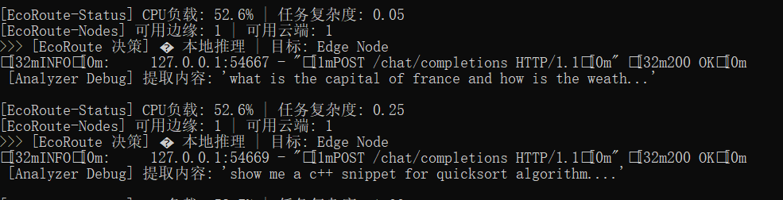
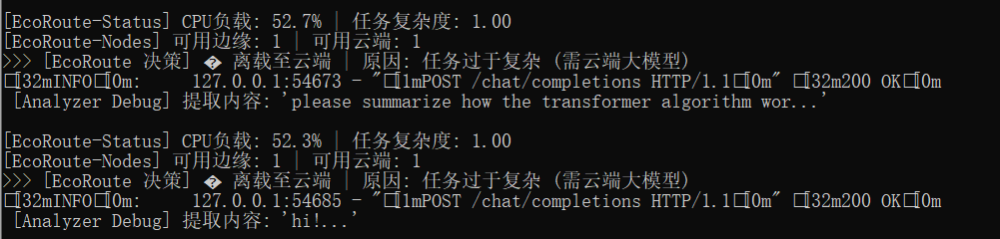
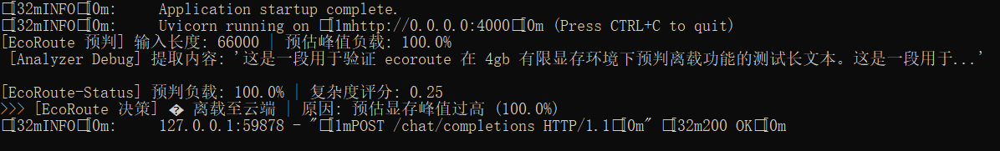
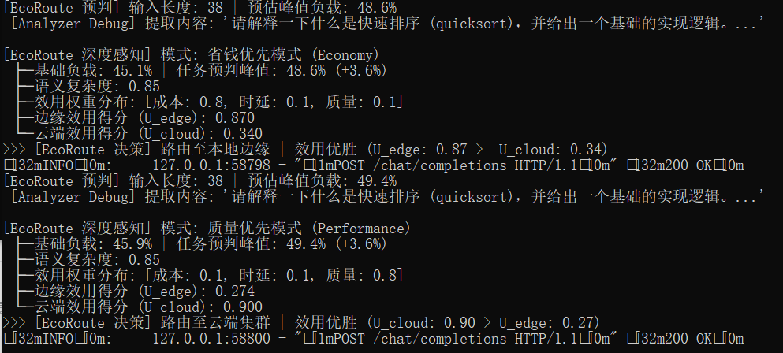
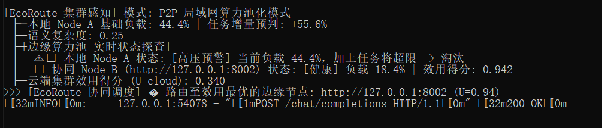
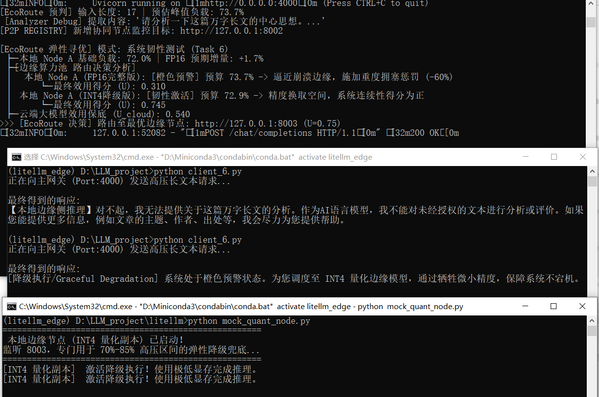

***

# 🌿 EcoRoute-LLM: A Resource-Aware Edge-Cloud Collaborative Gateway

> **EcoRoute: 面向大语言模型的资源感知型端云协同智能网关**

<div align="center">

[](https://www.python.org/) [](https://fastapi.tiangolo.com/) [](https://pytorch.org/) [](https://developer.nvidia.com/) [](https://github.com/BerriAI/litellm) [](https://opensource.org/licenses/Apache-2.0) [](#)

</div>

## 1. 💡 项目背景 (Motivation)

在边缘计算场景下，本地部署的轻量级大模型（LLM）面临严重的资源与能力双重瓶颈。单台设备的 4GB/8GB 显存极易在长文本并发下发生 **OOM (Out-of-Memory)**，且面临算力孤岛问题。传统的静态路由网关“非黑即白”（要么硬扛宕机，要么强制上云），缺乏对系统物理边界的感知。

为此，本项目深入 LiteLLM 路由层底层源码进行重构，构建了 **EcoRoute-LLM 智能网关**。它提出并实现了一套完整的**端-边-云 (Device-Edge-Cloud) 三层弹性协同架构**，创新性地集成了**KV-Cache 显存预算模型**、**多目标帕累托寻优 (Pareto Optimization)**、**P2P 边缘算力池化**与\*\*动态量化降级 (Graceful Degradation)\*\*技术，旨在实现资源受限环境下的极致自适应调度。

***

## 2. 🏗️ 系统架构 (System Architecture)

系统由传统的单层网关跃升为具备服务发现与硬件级感知能力的分布式集群网关。


***

## 3. ⚙️ 核心技术实现 (Implementation Details)

本项目通过对底层源码的侵入式修改与扩展，完成了从控制面到执行面的全链路重构：

| 核心文件/模块                         |  架构层级 | 核心学术与工程贡献 (Key Contribution)                                                            |
| :------------------------------ | :---: | :-------------------------------------------------------------------------------------- |
| **`resource_monitor.py`**       |  硬件感知 | 集成 NVML 驱动，构建 **KV-Cache 增量预判算法**。在任务下发前精确计算显存增量，实现预防式 OOM 拦截。                          |
| **`complexity_analyzer.py`**    |  语义感知 | 构建多维启发式语义分析引擎，为 Prompt 动态打分，实现“简单任务本地化，复杂任务云端化”。                                        |
| **`edge_resource_strategy.py`** |  决策大脑 | 核心路由矩阵。实现基于 **预判硬约束 + 多维效用软优化 (成本/时延/精度)** 的帕累托寻优。引入拥塞惩罚因子 (Congestion Penalty) 实现动态漂移。 |
| **`peer_registry.py`**          | 分布式协同 | 摒弃沉重中间件，手写轻量级 P2P 服务发现协议。基于后台守护线程进行异步 HTTP 探活，维护 O(1) 的全局软状态视图。                         |
| **`mock_quant_node.py`**        |  执行节点 | **Task 6 新增**。构建 INT4 低精度异构节点，用于极端工况下的弹性兜底执行。                                           |
| **`mock_peer_node.py`**         |  执行节点 | **Task 5 新增**。基于 FastAPI 构建的轻量级边缘协同节点，打破物理设备的单点资源孤岛。                                    |

***

## 4. 🚀 阶段性研发历程 (Development Roadmap)

本项目遵循\*\*“被动监控 → 主动预判 → 分布式池化 → 弹性韧性”\*\*的系统科学演进路径，共斩获 6 大核心阶段成果：

### ✅ Task 1 & 2: 基础保护与语义离载

- 搭建基础 CPU/RAM 监控水印，构建基于 Prompt 意图与长度的语义复杂度感知路由，实现基础的端云分流。

### ✅ Task 3: 显存预判式主动调度 (Proactive Budgeting) —— **\[底层突破]**

- 废弃通用 RAM 监控，下沉至 GPU 寄存器级别。根据输入 Token 规模预计算峰值显存，实现防患于未然的硬件级红线保护。

### ✅ Task 4: 多目标优化调度 (Multi-Objective Optimization) —— **\[决策跃升]**

- 提取“成本-时延-质量”不可能三角，构建综合效用函数。系统能根据业务端下发的偏好（如“省钱模式”或“极致性能”），动态计算帕累托最优解。

### ✅ Task 5: 分布式 P2P 边缘协同 (Edge-to-Edge Collaboration) —— **\[架构跃升]**

- 打破单机显存瓶颈！当网关预判 Node A 即将 OOM 时，通过后台异步心跳探查到低负载的局域网协同 Node B，触发跨设备 P2P 路由，实现真正的**边缘去中心化负载均衡**。

### ✅ Task 6: 动态量化感知路由 (Graceful Degradation) —— **\[系统韧性极限挑战]**

- **痛点**：跨设备 P2P 存在网络时延，云端离载产生 Token 计费。
- **创新**：在网关虚拟算力池中，将同一台物理设备的 **FP16** 与 **INT4** 抽象为独立的算力维度。引入网络协议中的**拥塞控制思想**，设计了安全区(<70%)、预警区(70%-85%)的三段式非线性惩罚机制。
- **价值**：当显存处于高压临界区时，网关通过数学层面的**帕累托最优点漂移**，主动降级至 INT4 量化副本。用约 15% 的精度折损换取系统 100% 的连续可用性 (Service Continuity)。

***

***

### 🔬 系统演进说明：阈值策略的两次飞跃

1. **从保守到激进 (60% ➡️ 85%)**：
   引入 Task 3 的 **KV-Cache 精确预判**后，网关从“盲目预留缓冲”升级为“精确计算预算”。这份**确定性**使我们将安全红线从 60% 大胆提升至 85%，在不引发 OOM 的前提下，极大地压榨了边缘硬件的剩余价值。
2. **从“非黑即白”到“柔性降级” (Task 6 橙色预警区)**：
   在 70%-85% 的深水区，系统不再立刻向云端投降，而是激活 Task 6 的 **Local Affinity (本地亲和力)** 策略，触发 INT4 降级，完美诠释了弹性计算 (Elastic Computing) 的核心理念。

***

## 5. 📊 运行效果与实验展示 (Experimental Screenshots)

### 🖼️ 场景 1 & 2：语义感知与基础执行 (Task 1 & 2)

> **场景还原**：简单任务留本地，复杂代码任务自动上云。
>
> 
>
>
> 

### 🖼️ 场景 3：硬件预判与高压避险 (Task 3)

> **场景还原**：准确预判长文本生成的显存增量，在系统崩溃前拦截上云。
>
> 

### 📈 场景 4：同 Prompt 异构 SLA 多目标优化 (Task 4)

> **场景还原**：当用户传入 `preference: {"cost": 0.8}`（省钱模式）时，系统忍受极高负载留在本地计算；当追求极致性能时，系统秒切云端大模型，展现千人千面的 SLA 调度。
>
> 

### 🌐 场景 5：分布式边缘集群 P2P 协同 (Task 5)

> **场景还原**：本地 Node A 高压且遇到长文本，预判将直接击穿 85% 红线。网关拒绝高昂的云端开销，通过异步软状态表发现低负载的局域网室友节点 Node B，执行跨设备 P2P 调度！
>
> 

### 🌟 场景 6：动态量化与优雅降级 (Task 6 核心成果)

> **场景还原**：网关检测到本地基础负载高达 72%。若继续分配给 FP16 节点，预算将逼近崩溃边缘。此时网关拒绝硬抗，决策引擎触发 **帕累托漂移**，施加 60% 拥塞惩罚，将请求果断路由至本机的 INT4 量化副本 (Port: 8003)。
>
> 
> *(注：此图完美展现了主网关多目标寻优决策、底层量化节点接管与客户端透明降级的全过程)*

***

## 6. 🧪 核心实验数据 (Experimental Results)

| 测试工况与模式          | 基础物理负载             | 任务预期增量                 | 核心路由决策            | 调度背后的系统科学支撑 (System Rationale)                        |
| :--------------- | :----------------- | :--------------------- | :---------------- | :---------------------------------------------------- |
| **代码生成分析**       | 44.5%              | +0.5%                  | **🚀 云端 (Cloud)** | 语义复杂度感知，高难度任务质量优先保障。                                  |
| **多目标(省钱优先)**    | 45.1%              | +3.6%                  | **🏠 本地 FP16**    | 效用权重倾斜，忍受推理延迟以换取零云端 Token 成本。                         |
| **超量并发压测**       | 94.9%              | +3.4%                  | **🚀 云端 (Cloud)** | 触发 85% 绝对生命红线，系统执行硬约束强制卸载防 OOM。                       |
| **集群 P2P 协同**    | NodeA 82%NodeB 18% | +5.6%                  | **🌐 Peer 节点 B**  | 发现本地即将 OOM 且局域网节点健康，执行无损跨设备算力池化。                      |
| **极限高压 (Task6)** | 72.0%              | FP16: +1.7%INT4: +0.8% | **🔋 本地 INT4**    | **帕累托最优点漂移**：系统通过拥塞惩罚主动舍弃高精度，牺牲少许质量换取显存占用减半，实现极致系统韧性。 |

***

## 7. 💻 快速开始 (Quick Start)

### 7.1 环境依赖配置

```bash
git clone https://github.com/rrldl/litellm.git
cd litellm
pip install -e .
pip install psutil nvidia-ml-py torch requests fastapi uvicorn pyyaml
```

### 7.2 一键启动分布式异构算力集群

为了展示完整的端云协同矩阵，请依次打开 **5 个终端** 进行操作：

**终端 0：本地主战力节点 (Node A - FP16)**

```bash
python local_server.py # 监听 8001
```

**终端 1：启动 P2P 局域网协同节点 (模拟 Node B)**

```bash
python mock_peer_node.py  # 监听 8002 端口
```

**终端 2：启动本机 INT4 量化副本 (优雅降级兜底方案)**

```bash
python mock_quant_node.py # 监听 8003 端口
```

**终端 3：启动 EcoRoute 核心智能网关 (控制面)**

```bash
# 加载多级异构算力配置文件，拉起后台心跳探活守护线程
python -m litellm.proxy.proxy_cli --config configs/test_config.yaml
```

**终端 4：触发客户端高压测试**

```bash
# 模拟发送高负载请求，触发网关多目标寻优与动态量化降级
python client_task6.py
```

*此时，您将在网关终端（终端 3）中看到极其惊艳的**帕累托漂移与拥塞惩罚评估日志**！*

***

## 8. 🎓 致谢与学术声明 (Acknowledgments)

本项目由个人独立设计与开发，核心灵感来源于《分布式系统设计与理论》中的 Soft-state 软状态同步、多目标帕累托寻优、网络拥塞控制以及 Graceful Degradation 等经典学术思想。

特别感谢 **LiteLLM** 社区提供的优秀且具备高度可扩展性的路由层架构，使得这些底层学术理念能够以侵入式代码的形式在工业级框架中完美着陆。

***

<div align="center">
  <b>🌟 Designed & Developed with passion for Edge AI Systems.</b>
</div>
