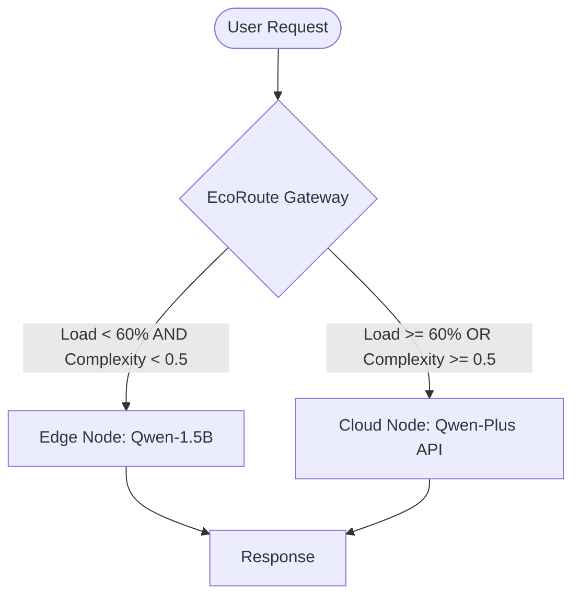

---

# EcoRoute-LLM: A Resource-Aware Edge-Cloud Collaborative Gateway
> **EcoRoute: 面向大语言模型的资源感知型端云协同智能网关**

[](https://opensource.org/licenses/Apache-2.0)
[](https://www.python.org/)

## 1. 项目背景 (Motivation)
在边缘计算场景下，本地部署的轻量级大模型（LLM）常面临两个瓶颈：
1. **资源瓶颈**：硬件负载过高导致显存溢出 (OOM) 或推理极慢。
2. **能力瓶颈**：小参数模型在处理代码生成、复杂数学证明等高难度任务时，回答质量远不如云端大模型。

**EcoRoute-LLM** 通过深入 LiteLLM 核心源码，实现了一个**双维度感知（硬件负载 + 任务复杂度）**的智能路由网关，确保任务在“本地稳定性”与“回答质量”之间取得最优平衡。

---

## 2. 系统架构 (System Architecture)

本项目在 LiteLLM 路由层植入了自定义 `EdgeResourceStrategy` 决策算子：



- **感知层**：实时监控 CPU/RAM 负载，并对 Prompt 进行启发式语义特征分析。
- **决策层**：基于双维度水印算法（Watermark）进行动态离载。
- **执行层**：无缝对接 OpenAI 兼容协议，支持本地后端与阿里云 Dashscope。

---

## 3. 核心进展 (Current Progress)

### ✅ Task 1: 硬件负载感知的自动化离载 (Watermark-based Offloading)
*   **实时监控**：集成 `psutil` 实现了亚秒级系统资源采样。
*   **动态切流**：设定 60% 负载阈值，成功实现高压状态下的任务平滑上云，保障了本地系统的稳定性。

### ✅ Task 2: 任务复杂度感知路由 (Complexity-Aware Dispatching)
*   **语义特征提取**：构建了基于关键词加权（Keyword Weighting）与文本长度惩罚的复杂度评估引擎。
*   **意图分流**：
    - **低复杂度**：基础闲聊（如 "Hi"）自动分配至本地，降低 Token 成本。
    - **高复杂度**：代码任务（如 "C++ QuickSort"）、算法分析、长文本总结等自动路由至云端，保障输出精度。
*   **链路打通**：重构了 `router.py` 的参数下发链路，解决了异步请求下的上下文丢失问题。

---

## 4. 运行效果展示 (Screenshots)

### 4.1 核心分流实验截图

> 这里展示了 EcoRoute 网关在不同场景下的实时决策日志，验证了“负载+复杂度”双感知逻辑：

#### 场景 1：简单任务留在本地


#### 场景 2：复杂任务触发上云


#### 场景 3：硬件负载过高触发上云


---

## 5. 实验数据 (Experimental Results)

| 测试场景 | 负载状态 | 任务复杂度评分 | 路由决策 | 实验结论 |
| :--- | :--- | :--- | :--- | :--- |
| 基础问候 (Hi) | 52.6% (低) | 0.05 (低) | **🏠 本地边缘侧** | ✅ 节省 Token，快速响应 |
| 逻辑对话 | 52.6% (中) | 0.25 (中) | **🏠 本地边缘侧** | ✅ 本地能力范围，低成本 |
| **代码生成 (C++)** | 52.7% (高) | **1.00 (极高)** | **🚀 云端离载** | ✅ 避开本地能力短板 |
| **长文总结** | 52.3% (低) | **0.85 (高)** | **🚀 云端离载** | ✅ 语义感知触发分流 |
| 极端负载压测 | **61.6% (高)** | 0.05 (低) | **🚀 云端离载** | ✅ 硬件保护触发离载 |
---

## 6. 快速开始 (Quick Start)

### 6.1 环境配置
```bash
git clone https://github.com/rrldl/litellm.git
pip install -e .
pip install llama-cpp-python psutil nvidia-ml-py
```

### 6.2 启动服务
1. **启动本地后端**:
   ```bash
   # 监听 8001 端口
   python local_server.py 
   ```
2. **启动 EcoRoute 智能网关**:
   ```bash
   python -m litellm.proxy.proxy_cli --config configs/test_config.yaml
   ```

### 6.3 验证决策 (PowerShell 示例)
```powershell
# 测试高复杂度分流
Invoke-RestMethod -Uri "http://127.0.0.1:4000/chat/completions" -Method Post -ContentType "application/json" -Body '{"model": "my-qwen", "messages": [{"role": "user", "content": "Show me a C++ snippet for quicksort."}]}'
```

---

## 7. 后续规划 (Roadmap)

### 🚀 Task 3: 显存级精准调度 (VRAM-Centric Monitoring)
*   **目标**：利用 `pynvml` 库直接获取 NVIDIA GPU 的实时显存占用，替代内存（RAM）指标，精准预防本地显存溢出。

### 🛠️ Task 4: 多目标优化调度 (Cost-Latency Optimization)
*   **目标**：建立帕累托最优模型，综合权衡 Token 成本、响应时延与任务紧迫度。

### 🌐 Task 5: 多节点边缘协同 (Multi-Edge Coordination)
*   **目标**：在局域网内实现跨设备的算力共享（Local P2P Dispatching）。

---

## 8. 致谢 (Acknowledgments)
感谢 **LiteLLM** 社区提供的可扩展架构，使得自定义路由策略的非侵入式开发成为可能。

---


