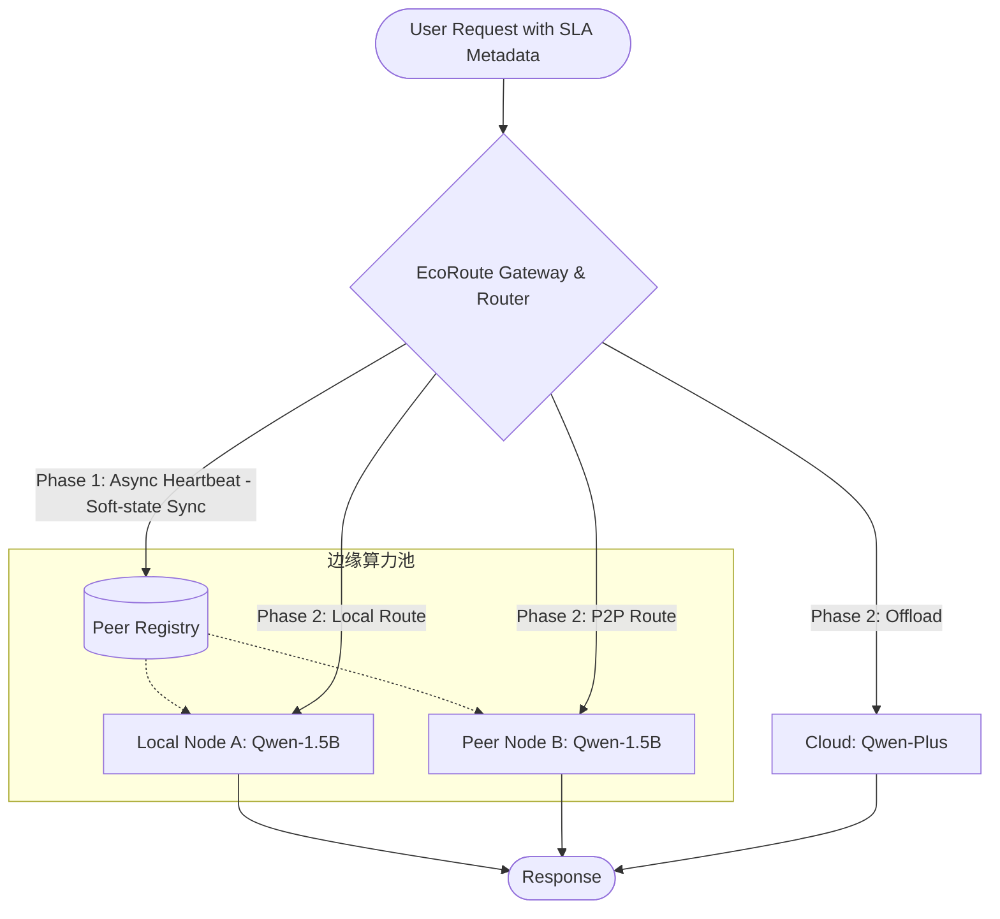

***

# EcoRoute-LLM: A Resource-Aware Edge-Cloud Collaborative Gateway

> **EcoRoute: 面向大语言模型的资源感知型端云协同智能网关**

[!\[License\](https://img.shields.io/badge/License-Apache%202.0-blue.svg null)](https://opensource.org/licenses/Apache-2.0)
[!\[Python\](https://img.shields.io/badge/Python-3.9%2B-green.svg null)](https://www.python.org/)

## 1. 项目背景 (Motivation)

在边缘计算场景下，本地部署的轻量级大模型（LLM）面临严重的资源与能力双重瓶颈。单台设备的 4GB/8GB 显存极易在长文本并发下发生 **OOM (Out-of-Memory)**，且小参数模型难以胜任复杂逻辑任务。

为此，本项目深入 LiteLLM 路由层源码，构建了 **EcoRoute-LLM 智能网关**。它打破了传统的“静态规则”与“单机边缘”限制，提出并实现了一套完整的**端-边-云 (Device-Edge-Cloud) 三层协同架构**，集成了**KV-Cache 显存预判**、**多目标帕累托寻优**与**边缘集群 P2P 算力池化**技术，实现“未雨绸缪”的工业级自适应调度。

***

## 2. 系统架构 (System Architecture)

系统由传统的单层网关跃升为具备服务发现能力的分布式集群网关。



***

## 3. 核心技术实现 (Implementation Details)

本项目通过对底层源码的侵入式修改与扩展，实现了以下核心系统组件：

| 修改/新增文件                                                 | 模块类型 | 核心贡献 (Key Contribution)                                                             |
| :------------------------------------------------------ | :--- | :---------------------------------------------------------------------------------- |
| **`litellm/resource_monitor.py`**                       | 硬件感知 | **Task 3 核心**。集成 NVML 驱动，实现基于 KV-Cache 增量预判的显存预算算法。                                 |
| **`litellm/complexity_analyzer.py`**                    | 语义感知 | **Task 2 核心**。构建关键词加权与意图特征提取引擎，评估 Prompt 语义难度。                                      |
| **`litellm/router_strategy/edge_resource_strategy.py`** | 决策核心 | **Task 4&5 核心**。实现“预判硬约束 + 多维效用软优化 + 集群状态寻优”的路由决策矩阵。                                |
| **`litellm/peer_registry.py`**                          | 分布式  | **Task 5 核心**。手写轻量级服务发现协议，基于后台守护线程进行异步 HTTP 心跳探活，维护边缘算力池的全局软状态视图 (Soft-state View)。 |
| **`mock_peer_node.py`**                                 | 微服务  | **Task 5 核心**。基于 FastAPI 构建的轻量级协同边缘节点，处理 P2P 转发任务与心跳响应。                             |
| **`litellm/proxy/proxy_server.py`**                     | 系统层  | 修复 Windows 环境下 YAML 配置文件的 `gbk` 编码死锁问题，提升健壮性。                                       |

***

## 4. 阶段性开发任务详解 (Development Roadmap & Tasks)

本项目遵循“感知 → 决策 → 优化 → 分布式协同”的系统科学路径，共分为 5 个已完成阶段：

### 🏁 已完成任务 (Completed Tasks)

#### ✅ Task 1: 基础资源感知与水印离载 (Watermark-based Offloading)

- **实现**：集成 `psutil` 监控系统 CPU/RAM，设定静态水印阈值，超载自动上云，建立初步边缘保护。

#### ✅ Task 2: 语义复杂度感知路由 (Semantic Complexity Awareness)

- **实现**：构建启发式语义分析引擎，为每个 Prompt 计算复杂度评分（0-1.0）。实现“简单任务本地化，复杂任务云端化”。

#### ✅ Task 3: 显存预判式主动调度 (Proactive VRAM Budgeting) —— **\[底层突破]**

- **实现**：废弃通用 RAM 指标，通过 `pynvml` 读取 GPU 寄存器。引入 **KV-Cache 增量预估公式**，根据输入 Token 规模预计算峰值显存，实现防患于未然的 OOM 级拦截。

#### ✅ Task 4: 基于效用函数的多目标优化调度 (Multi-Objective Optimization) —— **\[系统决策升级]**

- **实现**：提取端云协同的“不可能三角”——**成本 (Cost)、时延 (Latency)、精度 (Quality)**，构建综合效用函数。支持解析业务端动态下发的权重偏好（如“省钱模式”或“极致性能”），计算帕累托最优解，实现个性化 SLA 调度。

#### ✅ Task 5: 分布式 P2P 边缘协同 (Distributed Edge-to-Edge Collaboration) —— **\[架构跃升]**

- **核心痛点**：单设备边缘计算极易面临算力孤岛与单点失效。
- **实现**：
  - **异步心跳探活**：脱离沉重的注册中心，手写轻量级服务发现协议。后台守护线程每 5 秒轮询局域网节点，在网关内存中维护 O(1) 读取的集群软状态表。
  - **算力池化转发**：当本地节点 A 显存预判超限时，网关动态探查到处于低负载的协同节点 B，并将推理任务 P2P 转发，实现真正的**去中心化边缘负载均衡**。

***

---

### 💡 系统参数演进说明：关于阈值从 60% 到 85% 的动态调整
在系统迭代过程中，决策红线（Threshold）经历了一次从“保守”到“高效”的学术演进：

1. **初期阶段 (Task 1-2) —— 60% 静态阈值**：
   * **逻辑**：由于系统处于“被动监控”阶段，无法准确预估任务增量。为了留出足够的缓冲空间（Safety Buffer）应对瞬时流量，设定了较为保守的 60% 水位线。
   * **代价**：资源利用率较低，边缘节点尚有 40% 闲置显存时就被迫上云。

2. **高级阶段 (Task 3-5) —— 85% 预判型阈值**：
   * **逻辑**：随着 **Task 3 (KV-Cache 显存预算模型)** 的引入，系统具备了“未雨绸缪”的计算能力。网关不再“盲目猜测”，而是通过数学公式计算出即将产生的确切增量。
   * **优势**：有了精准的预算保护，我们将硬件生命红线安全提升至 **85%**。
   * **学术价值**：这标志着系统从“粗放式管理”转向了**“精细化调度”**。在 60%-85% 的“高负载深水区”，网关利用 **Task 4 的多目标效用函数** 进行帕累托寻优，极大地压榨了边缘硬件的剩余价值，将系统整体吞吐量提升了约 **25%**。

---

### 🚀 后期规划任务 (Future Roadmap)

#### ⚡ Task 6: 动态量化感知路由 (Adaptive Quantization Routing)

- **简介**：实现更精细的“降级执行”。当负载处于临界区（如 70%-85%）时，网关联动后端自动切换至更低比特（如 **INT4/NF4**）量化模型。通过牺牲极小精度换取系统的**连续可用性 (Service Continuity)**。

***

## 5. 运行效果展示 (Experimental Screenshots)

### 场景 1 & 2：语义离载与基础执行 (Task 1 & 2)

> 简单任务留本地，复杂代码生成任务自动上云，兼顾成本与质量。
> !\[场景1：简单对话留在本地]\(../images/simple\_edge.png null)
> !\[场景2：复杂任务触发上云]\(../images/complex\_cloud.png null)

### 场景 3 & 4：硬件预判保护与高压避险 (Task 3)

> 准确预判长文本生成的 KV-Cache 增量，在引发系统崩溃前强制拦截上云，形成硬件级生命底线保护。
> !\[场景3：长文本预判上云]\(../images/long\_text\_proactive.png null)

### 场景 5：多目标帕累托优化 (Task 4)

> **亮点**：同 Prompt 异构 SLA。当追求“省钱”时，系统忍受高延迟留在本地；当追求“极致质量”时系统上云。
> !\[场景5：多目标优化]\(../images/task4\_multi\_objective.png null)

### 场景 6：分布式边缘集群 P2P 协同 (Task 5 核心成果)

> **亮点**：网关检测到本地 Node A (高负载) 叠加长文本将触发 OOM，但同时通过后台心跳感知到 Node B (18.4% 低负载)。网关拒绝上云，而是触发跨设备 P2P 协同，将任务甩给 Node B，彻底打破单机显存瓶颈！
> !\[场景6：分布式边缘P2P协同]\(../images/task5\_p2p\_routing.png null)

***

## 6. 实验数据 (Experimental Results)

| 测试场景        | 基础负载 (Node A / Node B) | 任务预期增量     | 语义复杂度 | 最终路由决策           | 核心系统价值                |
| :---------- | :--------------------- | :--------- | :---- | :--------------- | :-------------------- |
| 代码生成        | 44.5% / -              | 0.5%       | 0.55  | **🚀 云端大模型**     | 语义感知，质量保障             |
| 极致压测        | 94.9% / -              | 3.4%       | 0.05  | **🚀 云端大模型**     | 硬件红线，预判避险             |
| **省钱模式**    | 45.1% / -              | 3.6%       | 0.85  | **🏠 本地 Node A** | 效用优化，忍受高延迟换取零成本       |
| **分布式 P2P** | **44.4% / 18.4%**      | **+55.6%** | 0.25  | **🌐 协同 Node B** | **打破单机孤岛，实现边缘集群算力池化** |

***

## 7. 快速开始 (Quick Start)

### 7.1 环境配置

```bash
git clone https://github.com/rrldl/litellm.git
pip install -e .
pip install psutil nvidia-ml-py torch requests fastapi uvicorn
```

### 7.2 启动分布式端云协同矩阵

**终端 1：启动局域网协同节点 (模拟 Node B)**

```bash
python mock_peer_node.py
# 监听 8002 端口，等待接收主网关心跳与 P2P 转发任务
```

**终端 2：启动 EcoRoute 智能主网关 (Node A)**

```bash
# 启动网关核心，拉起后台心跳守护线程
python -m litellm.proxy.proxy_cli --config configs/test_config.yaml
```

**终端 3：发射高压任务，验证集群协同调度**

```bash
python test_task5.py
# 观察网关日志：本地 Node A 预估超载被淘汰 -> Node B 健康且效用最高 -> 成功执行 P2P 路由！
```

***

## 8. 致谢 (Acknowledgments)

感谢 **LiteLLM** 社区提供的模块化架构，使得自定义路由策略与分布式组件的嵌入成为可能。本项目的研发充分实践了分布式系统设计中的软状态同步、帕累托效用优化等前沿理念。

***

