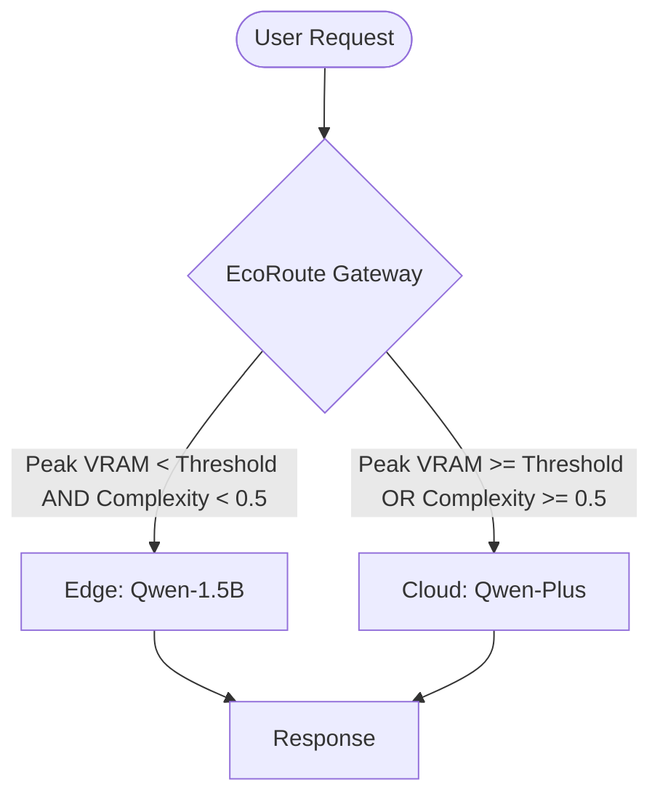

---

# EcoRoute-LLM: A Resource-Aware Edge-Cloud Collaborative Gateway
> **EcoRoute: 面向大语言模型的资源感知型端云协同智能网关**

[](https://opensource.org/licenses/Apache-2.0)
[](https://www.python.org/)

## 1. 项目背景 (Motivation)
在边缘计算场景下，本地部署的轻量级大模型（LLM）面临双重挑战：
1. **显存瓶颈**：4GB 等小显存设备在处理长文本时极易发生 **OOM (Out-of-Memory)**。
2. **能力瓶颈**：小参数模型难以胜任高难度语义任务。

**EcoRoute-LLM** 通过深入 LiteLLM 路由层源码，构建了一个**预判式（Proactive）**调度网关。它不仅能监控当前负载，还能根据输入文本提前预算显存需求，实现“未雨绸缪”的离载调度。

---

## 2. 系统架构 (System Architecture)



---

## 3. 核心技术实现 (Implementation Details)

本项目通过对 LiteLLM 源码的侵入式修改，实现了以下核心组件：

| 修改/新增文件 | 模块类型 | 核心贡献 (Key Contribution) |
| :--- | :--- | :--- |
| **`litellm/resource_monitor.py`** | 感知层 | **Task 3 核心**。集成 NVML 驱动，实现基于 KV-Cache 增量预判的显存预算算法。 |
| **`litellm/complexity_analyzer.py`** | 感知层 | **Task 2 核心**。构建关键词加权与意图特征提取引擎，评估 Prompt 语义难度。 |
| **`litellm/router_strategy/edge_resource_strategy.py`** | 决策层 | 实现负载预判（Projected Load）与语义复杂度双维度的路由决策矩阵。 |
| **`litellm/router.py` (源码修改)** | 接入层 | 注册自定义路由策略，打通 Context 消息传递链路，解决异步上下文丢失 Bug。 |
| **`litellm/proxy/proxy_server.py` (修改)** | 系统层 | 修复 Windows 环境下 YAML 配置文件的 `gbk` 编码死锁问题，提升健壮性。 |


---

## 4. 阶段性开发任务详解 (Development Roadmap & Tasks)

本项目遵循“感知 $\rightarrow$ 决策 $\rightarrow$ 优化”的学术路径，共分为三个已完成阶段及三个规划阶段：

### 🏁 已完成任务 (Completed Tasks)

#### ✅ Task 1: 基础资源感知与水印离载 (Watermark-based Offloading)
*   **目标**：建立初步的边缘保护机制。
*   **实现**：集成 `psutil` 监控系统 CPU 与 RAM。通过设定 **60% 静态水印阈值**，当系统整体负载超标时，网关自动将请求重定向至云端，解决了边缘节点在高并发下的死机问题。

#### ✅ Task 2: 语义复杂度感知路由 (Semantic Complexity Awareness)
*   **目标**：解决边缘小模型“能力不足”导致的回答质量差问题。
*   **实现**：构建了一个**启发式语义分析引擎**。通过关键词权重匹配（如 `C++`, `Algorithm` 等高频逻辑词）结合文本长度特征，为每个 Prompt 计算复杂度评分（0-1.0）。实现“简单任务本地化，复杂任务云端化”。

#### ✅ Task 3: 显存预判式主动调度 (Proactive VRAM Budgeting) —— **[核心突破]**
*   **目标**：彻底解决 LLM 推理中最核心的 **OOM (显存溢出)** 风险。
*   **实现**：
    *   **底层接入**：废弃通用的 RAM 指标，通过 `pynvml` 直接读取 NVIDIA GPU 寄存器的实时显存。
    *   **预算模型**：引入 **KV-Cache 增量预估公式**。在推理开始前，根据输入的 Token 规模预计算即将产生的显存峰值。
    *   **主动防御**：实现“环境负载 + 任务增量”的双重判定，即使在 4GB 显存的极端受限环境下，也能通过预判精准避险。

---

### 🚀 后期规划任务 (Future Roadmap)

#### 🛠️ Task 4: 多目标优化调度 (Multi-Objective Pareto Optimization)
*   **简介**：不再单一依赖阈值判断，而是引入**帕累托最优**决策。综合权衡 **Token 成本 (Cost)**、**响应时延 (Latency)** 与 **模型精度 (Accuracy)**，根据用户优先级偏好（如“省钱模式”或“极致性能”）动态调整路由策略。

#### 🌐 Task 5: 边缘 P2P 协同计算 (Edge-to-Edge Cluster Coordination)
*   **简介**：打破单设备瓶颈，构建**边缘算力池**。当本地节点 A 显存不足时，网关通过服务发现机制搜索局域网内的空闲节点 B。实现跨设备的负载均衡，最大化边缘侧的整体吞吐量。

#### ⚡ Task 6: 动态量化感知路由 (Adaptive Quantization Routing)
*   **简介**：实现更精细的“降级执行”。当负载处于临界区（如 70%-85%）时，网关不再简单上云，而是联动后端自动切换至更低比特（如 **INT4/NF4**）的量化模型。通过牺牲极小精度来换取系统的**连续可用性 (Service Continuity)**。

---


## 5. 运行效果展示 (Experimental Screenshots)

### 场景 1：基础任务本地执行 (Task 1 & 2 成果)
> 当负载低且复杂度低时，系统选择本地边缘侧以降低 Token 成本。
 


### 场景 2：高难度任务语义离载 (Task 2 成果)
> 识别出代码生成等复杂逻辑，自动切换至云端大模型。


### 场景 3：长文本显存预算预判 (Task 3 核心成果)
> **亮点**：即使机器空闲，但因输入极长，算法预判到生成的 KV-Cache 将导致 OOM，提前拦截并上云。
 

### 场景 4：硬件负载饱和保护 (Task 3 核心成果)
> **亮点**：模拟后台任务挤占显存。即便任务极简，系统为保护硬件稳定性，强制执行云端离载。


---

## 6. 实验数据 (Experimental Results)

| 测试场景 | 硬件基础负载 | 任务预期增量 | 语义复杂度 | 路由决策 | 核心价值 |
| :--- | :--- | :--- | :--- | :--- | :--- |
| 基础问候 | 44.5% | 0.1% | 0.05 | **🏠 本地** | 节省 Token，快速响应 |
| **代码生成** | 44.5% | 0.5% | **0.55** | **🚀 云端** | 语义感知，质量保障 |
| **超长文本** | 47.0% | **53.0%** | 0.25 | **🚀 云端** | **预判避险，防止 OOM** |
| 极限压测 | **94.9%** | 3.4% | 0.05 | **🚀 云端** | **硬件红线保护** |

---

## 7. 快速开始 (Quick Start)

### 7.1 环境配置
```bash
git clone https://github.com/rrldl/litellm.git
pip install -e .
pip install psutil nvidia-ml-py torch
```

### 7.2 启动 EcoRoute 智能网关
```bash
# 启动网关端口 4000
python -m litellm.proxy.proxy_cli --config configs/test_config.yaml
```

### 7.3 验证 Task 3 预判能力 (PowerShell)
```powershell
# 构造超长文本模拟显存溢出风险
$long_content = "测试文本" * 2000
$body = @{ model="my-qwen"; messages=@(@{role="user"; content=$long_content}) } | ConvertTo-Json
$bytes = [System.Text.Encoding]::UTF8.GetBytes($body)
Invoke-RestMethod -Uri "http://127.0.0.1:4000/chat/completions" -Method Post -ContentType "application/json; charset=utf-8" -Body $bytes
```

---

## 8. 后续规划 (Roadmap)
*   **Task 4**: 实现多目标优化调度（综合权衡成本、时延与模型精度）。
*   **Task 5**: 实现边缘 P2P 协同推理（跨设备显存池化）。
*   **Task 6**: 动态量化感知路由（负载临界区自动切换 INT4 量化模型）。

---

## 9. 致谢 (Acknowledgments)
感谢 **LiteLLM** 社区提供的模块化架构，使得自定义路由策略的实现成为可能。

---
